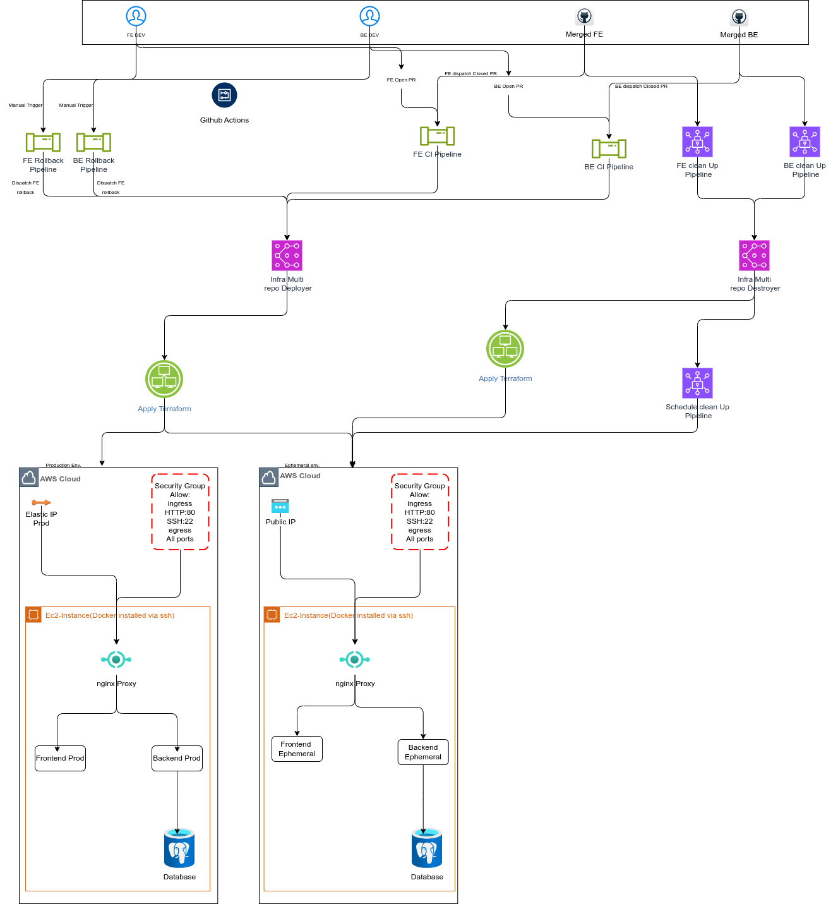

# Capstone Project Architecture

This document provides a high-level overview of the architectural components and the CI/CD pipeline for the Phoenix Capstone project.

## High-Level Architecture

The project consists of three main repositories:
1.  **Frontend**: React application served by Nginx.
2.  **Backend**: Node.js/Express API connected to a PostgreSQL database.
3.  **Infrastructure**: Terraform code for AWS provisioning and GitHub Actions for deployment orchestration.

### System Diagram

### Component Breakdown

| Component | Description | Technologies |
| :--- | :--- | :--- |
| **Frontend** | Client-side application providing the user interface. | React, Docker |
| **Backend** | Server-side API providing business logic and database access. | Node.js, Express, Docker |
| **Database** | Persistent storage for application data. | PostgreSQL, Docker |
| **Nginx Proxy** | Reverse proxy handling routing between frontend and backend. | Nginx, Docker |
| **Infrastructure** | Cloud resources provisioning and configuration management. | Terraform, AWS (EC2, EIP, SG) |
| **CI/CD** | Automated pipeline for testing, building, and deploying. | GitHub Actions, Docker Hub |

## CI/CD Pipeline Flow

1.  **Code Commit**: Developers push changes to Frontend or Backend repositories.
2.  **CI Run**: Workflows build Docker images and push them to Docker Hub with tags (e.g., commit SHA or Semantic Version).
3.  **Repository Dispatch**: CI workflows trigger the `capstone-infra` repository via `repository_dispatch`.
4.  **Deployment**:
    *   `terraform apply` updates infrastructure (Security Groups, EC2 tags).
    *   Files (`docker-compose.yml`, `nginx.conf`) are transferred via SCP.
    *   `docker compose pull` and `docker compose up` are executed via SSH to refresh the containers.
5.  **Environment Isolation**: 
    *   **Ephemeral**: Created for Pull Requests (e.g., `pr-123` workspace).
    *   **Production**: Updated on merges to `main` branch (e.g., `prod` workspace with Elastic IP).
6.  **Manual Rollback**:
    *   Triggered manually via `workflow_dispatch` in Frontend or Backend repositories.
    *   Requires a valid version tag and "ROLLBACK" confirmation.
    *   Triggers infrastructure deployment to use the specified older image version.
    *   Automatically creates a GitHub Issue to track the rollback event.
7.  **Resource Cleanup**:
    *   **Automated (On Merge/Close)**: Triggered via `repository_dispatch` (`destroy_ephemeral`) when a Pull Request is merged or closed in the app repositories.
    *   **Scheduled (AWS Reaper)**: Runs every 30 minutes to identify and terminate stale EC2 instances older than 30 minutes, ensuring no "zombie" resources persist.
    *   **Terraform Destroy**: The clean-up workflow executes `terraform destroy` for the specific PR workspace and then deletes the workspace itself.
